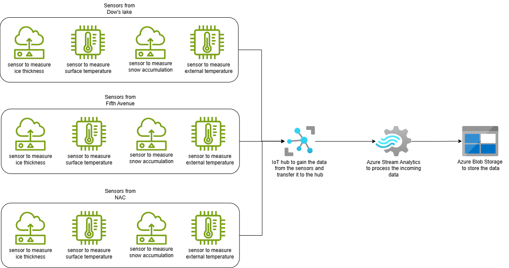

# CST_8916_Final_Project

## Scenario description

In the Rideau Canal during winter, there is a lot of people who skates on the canal. However, there could be a real issue that the ice can break and hurt a lot of skaters. Therefore, engineers implemented sensors to scan and calculate if the ice will be breaking. The sensors are in 3 locations: Dow's Lake, Fifth Avenue, and National Arts Center (NAC). The sensors monitor 4 values: ice thickness, surface temperature, snow accumulation, and external temperature. After it gets the values, it calculates to get the average ice thickness and maximum snow accumulation. This system is helpful to tell if the ice could break depending on the ice. The ice can break easily if either the ice thickness average is low, surface temperature is high, maximum snow accumulation is high, and external temperature is high. Therefore, we developed a real time system to track these changes.

## System Architecture

### IoT Sensor Simulation



For this assignment, we don't have any actual real-life sensors to gain the data. Instead, we use a python program to generate the data and send them to the sensors in the IoT Hub. In the program, it goes in a while loop to gain the data every 10 seconds. The data is generated randomly from 0 to 30 cm of the length data and -20 to 20 *C of the temperature data. There are 3 programs represents each location and they are connected to the sensors using a connection string. 

Examples of a json payload generated displayed bellow:

The application used to run these programs is visual studios connected to a virtual machine.

### Azure IoT Hub Configuration

go to the Azure portal website and first create your own group. The group name is SkatingMonitoring and the Region Should be Canada. Then make the IoT Hub and fill in the details in basics:

- **Subscription**: Select your subscription.
- **Resource group**: Choose `SkatingMonitoring`.
- **IoT hub name**: `cst8916iothub`.
- **Region**: `Canada`
- **Tier**: `Free`
- **Daily message limit**: `8,000 ($0/month)`

Go to `Review + create` and click `Create`.

After the IoT Hub is set up, go to the Device subtab in device management group tab. Then create 3 sensors by clicking the create button and name them sensor1, sensor2, sensor3. After creating the sensors, copy the primary connection string from each sensor and then use them in the program files to connect to them.

### Azure Stream Analytics Job

In Azure portal, create a new Azure Stream Analytics Services and fill in basics:

- **Subscription**: Select your subscription.
- **Resource group**: Choose `SkatingMonitoring`.
- **IoT hub name**: `cst8916streamanalytics`.
- **Region**: `Canada`
- **Hosting enviroment**: `Cloud`

Go to `Review + create` and click `Create`.

After creating the Stream Analytic service, you need to set up the following tabs in the Job topology submenu which are Inputs, Query, and Output

In the Input menu, select Add input and select IoT Hub. If you already made the IoT Hub in the same resource group, then it will detect it automatically. If not, create the IoT Hub service. Change the input alias to `input` so that queue job will detect it. After changing the alias, click save and go to the next part. 

In the Output menu, select Add output and select Blob storage. If you already made the Blob storage in the same resource group, then it will detect it automatically. If not, create the Blob storage service. Change the input alias to `output` so that queue job will detect it. After changing the alias, click save and go to the next part. 

In the Query tab, this is where it takes the imputed values from the IoT device, process it with a queue and store the new values in the blob storage. Copy the content bellow and replace it with the default query:

```
SELECT
    IoTHub.ConnectionDeviceId AS DeviceId,
    AVG(iceThickness) AS AvgIceThickness,
    MAX(snowAccumulation) AS MAXSnowAccumulation,
    System.Timestamp AS EventTime
INTO
    [output]
FROM
    [input]
GROUP BY
    IoTHub.ConnectionDeviceId, TumblingWindow(second, 300)
```

The query above calculate the average ice thickness and the maximum snow accumulation that it got it data from the IoT device. The incoming data is grouped by device id and goes over 5 mins or 300 seconds intervals. The JSON in the results displays the device id, average ice thickness, max snow accumulation, and event time and it goes to the blob storage.

### Azure Blob Storage

In Azure portal, create a storage account and fill in basics:

- **Subscription**: Select your subscription.
- **Resource group**: Choose `SkatingMonitoring`.
- **IoT hub name**: `cst8916storageaccount`.
- **Region**: `Canada`
- **Primary service**: `Azure Blob Storage or Azure Data Lake Storage Gen 2`
- **Performance**: `Standard`
- **Redundancy**: `Locally-redundant storage (LRS)`

Go to `Review + create` and click `Create`. After the storage account is created, go to the Containers tab in the Data storage section and select `+ Container` and put the name iotoutput. The results from the Azure Blob Storage will go to the container in the blob storage as a json file. 

## Running the IoT Sensor Simulation

In order to run the each of the sensors is first is to make a virtual machine on Azure. To do that is to first click the Virtual machine service and then the create button. After that, fill in the following:

- **Subscription**: Select your subscription.
- **Resource group**: Choose `SkatingMonitoring`.
- **Virtual machine name**: `cst8916VM`
- **Image**: `Ubuntu Server 24.04 LTS - x64 Gen2`
- **Size**: `B1s` (recommended `B2s`)
- **Username**: (your username)
- **Key pair name**: `cst8916VM_key`

After that, click `Review + create` and then click `Create`. You probably download the private key file, so put that private key file to .ssh director stored in your pc. In Visual studio, go to your config file and change the ip and the private key location to the one that matches the new virtual machine. Then connect to the virtual machine to open virtual machine in your virtual studios. 

Now you need to clone the repo, install python, and run each sensor. open a new terminal and clone by writing

```
git clone https://github.com/mo10serek/CST_8916_Final_Project.git
```

and go in your cloned repository. to run the sensors, you need to install python program and all the dependences. To do that write the following:

```
sudo apt upgrade
apt install python3-venv
sudo apt install python3-venv

python3 -m venv venv
source venv/bin/activate
pip install -r requirements.txt
```

After installing python, make the 3 sensors in IoT Hub that is explained in the Azure IoT Hub Configuration and then take the connection string from each of them and passed each corresponding python file. In the first terminal, run sensor1.py and you will see the list of sent messages. Then make two terminals and run:

```
python3 -m venv venv
source venv/bin/activate
pip install -r requirements.txt
```

in the two terminals run the next two sensor scripts which are sensor2.py and sensor3.py and you will see that all sensors are running.

## Results

When you run all the services and their connections between them. All the results of the process data will go to Blob Storage in a json format. The sample of calculated data displayed bellow:

```
{"DeviceId":"sensor_Fifth_Avenue","AvgIceThickness":16.02490252603045,"MAXSnowAccumulation":29.471732850363964,"EventTime":"2025-03-30T17:15:00.0000000Z"}
{"DeviceId":"sensor_NAC","AvgIceThickness":15.188878049016722,"MAXSnowAccumulation":29.70508551982959,"EventTime":"2025-03-30T17:15:00.0000000Z"}
{"DeviceId":"sensor_Dow's_Lake","AvgIceThickness":16.176846495944233,"MAXSnowAccumulation":29.72179310109246,"EventTime":"2025-03-30T17:15:00.0000000Z"}
```

This shows that it calculates the average of the ice thickness and the max snow accumulation for each location every 10 seconds and send the final output every 5 mins.

## Reflection

This assignment helps me to understand how to how to run real time applications on Azure. The only challenge I have is setting up how to run the sensors scripts with the dependences. To run the scripts with the dependences, I need to add a requirement.txt file with the dependence `azure-iot-device`. However, I need to run the scripts in Linux, so I made a virtual machine in Azure. Another problem is that I need to run install python in the virtual machine, so I look for a solution on how to install python in Linux. After I figure out all these problems. I can run the scripts well. 
